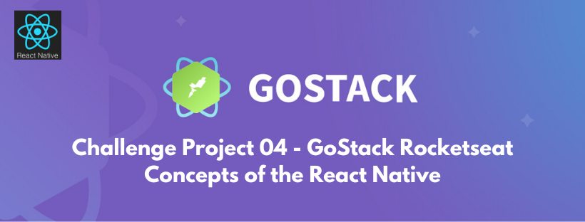
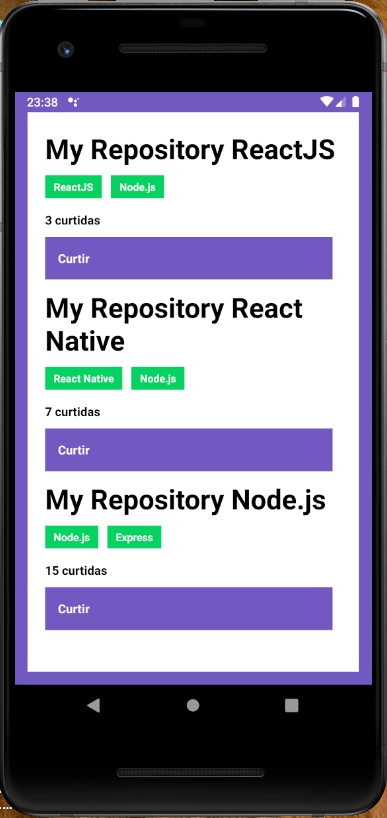
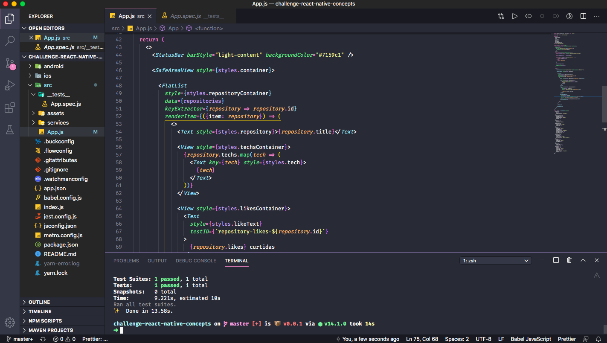

<h2 align="center"> 
  GoStack Rocketseat - Challenge 04 - Concepts of the React Native
</h2>

<p align="center">
  
</p>

<blockquote align="center">“Always evolving and learning more every day!”</blockquote>

<p align="center">

</p>

Below is the link to the Skylab course platform, where this project is part of the GoStack Rocketseat.
https://skylab.rocketseat.com.br/

### Application developed with React Native:

### A view of the application Challenge Project 04 - GoStack Rocketseat::

<p align="center">
  
</p>

### To install the application:

This is a [React Native](https://reactnative.dev/) project challenge. For install this project after clone, use next steps:

```bash
$ yarn
```
### To run the application:

After complete instalation, run the aplication with command VScode emulator Android Studio :

```bash
$ react-native run-android
```

Or after complete instalation, run the aplication with command VScode emulator XCode iOS :

```bash
$ react-native run-ios
```

View this aplication in your emulator device Android or iOS

### A partial view of the application code in Visual Studio Code::

<p align="center">
  
</p>

### Learn more about me. Hire!

  https://www.linkedin.com/in/alexgomesnet/

### License:

  [MIT](LICENSE)
